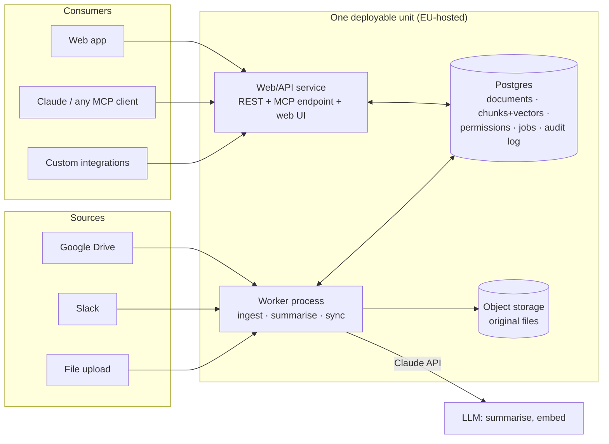
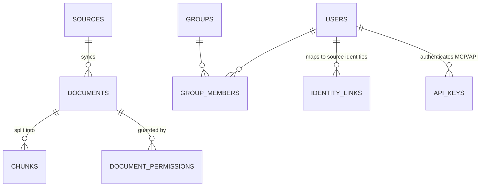
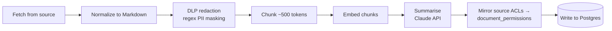

# Knowledge Platform — Architecture

*A scalable-but-simple architecture for a governed, permission-aware knowledge
layer (a "Guru-like" platform), designed to be built incrementally and
maintained by a single non-specialist owner with AI assistance.*

---

## 1. The one-paragraph version

Build a **modular monolith**: one TypeScript codebase, deployed as **two
processes** (a web/API service and a background worker) on top of **one
Postgres database** that does everything — documents, embeddings, full-text
search, permissions, job queue, and audit log. Every feature in the end-goal
(deduplication, verification, authoring, Slack bots, browser extensions) is
either a **new job type** running in the worker or a **new client** of the same
search/fetch API. Nothing in the roadmap requires new infrastructure, only new
code — which is exactly what you want when you're the only maintainer.



---

## 2. Design principles (why this shape)

These four rules are what keep the system maintainable by one person while
still scaling to the full vision:

1. **One database is the spine.** Postgres with the `pgvector` extension
   handles relational data, vector search, full-text search, the job queue,
   and the audit trail. No Elasticsearch, no Redis, no Kafka, no separate
   vector database. Each of those is a thing that can break at 2am; Postgres
   alone comfortably handles millions of document chunks.

2. **A modular monolith, not microservices.** One codebase where each of the
   eight capability "buckets" is a folder (module), not a separate service.
   Modules call each other as plain functions. If one day a module truly needs
   to scale independently, it can be split out then — but that day is years
   away, if ever.

3. **Everything is a pipeline job writing to tables.** Ingestion,
   summarisation, deduplication, gap detection, verification, archival —
   every "smart" feature in the end-goal is a background job that reads
   documents from Postgres, calls an LLM, and writes results back to Postgres.
   Adding bucket 2 or bucket 4 later means adding *job types*, not systems.

4. **Permissions are data, enforced in one place.** A single
   `visibleDocumentsFor(user)` filter is applied inside the one search/fetch
   code path that *every* surface uses — web app, REST API, MCP server, and
   the future Slack bot. There is exactly one door, so there is exactly one
   lock to get right.

And one meta-rule: **buy anything that isn't the product.** Auth, hosting,
backups, LLMs, email — all managed services. The product is the pipeline +
the governed index; everything else is rented.

---

## 3. Concrete stack recommendation

| Layer | Choice | Why |
|---|---|---|
| Language | **TypeScript (Node.js)** everywhere | One language for API, worker, MCP server, and UI. Your existing project (Iron Ladder) is already TypeScript/Vite, and the official MCP SDK is TypeScript-first. |
| API framework | **Hono** or **Fastify** | Small, boring, well-documented. Serves the REST API, the MCP endpoint, and the static web UI from one process. |
| Database | **Supabase (EU region — Frankfurt)** | Managed Postgres with `pgvector`, plus built-in auth (email, Google, later SAML), row-level security, file storage, and automatic backups — one dashboard for a non-specialist. Alternatives: Scaleway or Neon (EU). |
| Job queue | **pg-boss** | A job queue that lives *inside* Postgres. No extra infrastructure; jobs survive restarts; retries and scheduling (cron) built in. |
| Hosting | **Railway, Render, or Fly.io — EU region (Frankfurt/Amsterdam)** | Push code, it deploys. Run two processes from one repo: `web` and `worker`. Scaleway if you want an EU-headquartered provider. |
| LLM | **Claude API** (summarisation, dedup, drafting) | For strict EU data-residency requirements, use Claude through **AWS Bedrock (eu-central-1)** or **Google Vertex AI (europe-west)** — the direct Anthropic API processes in the US. Start direct, switch the base URL when a customer demands EU processing. |
| Embeddings | **Behind a thin wrapper** — Voyage or OpenAI to start; Mistral Embed (EU) or Bedrock (EU) for residency | Wrapping it in one function (`embed(texts)`) makes the provider swappable without touching anything else. |
| File storage | Supabase Storage (or Scaleway S3) | Originals (PDFs, images) live here; Postgres stores the extracted text. |
| Web UI | **Vite + React SPA**, served by the API process | Same tooling as your existing app. |
| Frontend/backend contract | Plain JSON REST | Avoid GraphQL/tRPC; plain fetch calls are easiest to debug and to have AI maintain. |

**Repository layout** (one repo):

```
knowledge-platform/
├── src/
│   ├── db/            # schema, migrations, query helpers
│   ├── core/          # THE important module: search(), authorize(), cite()
│   ├── ingest/        # connectors + normalize → chunk → embed → summarise
│   ├── mcp/           # MCP server (thin — calls core/)
│   ├── api/           # REST routes (thin — calls core/)
│   └── worker/        # pg-boss job handlers + schedules
├── web/               # Vite + React UI
└── docs/              # this document, runbook, decisions
```

The rule that keeps this clean: **`api/` and `mcp/` contain no logic.** They
parse requests, call functions in `core/`, and format responses. All search,
permission, and citation logic lives in `core/` once.

---

## 4. Data model (the heart of the system)

Eight tables carry the MVP; everything later builds on them.



| Table | Purpose | Key columns |
|---|---|---|
| `sources` | A connected system (one Drive folder, one Slack workspace, "manual uploads") | type, config (JSON), sync cursor, schedule |
| `documents` | One logical piece of knowledge | title, `canonical_markdown`, `summary`, content_hash, status (`active/draft/archived`), source URL, timestamps |
| `chunks` | Search units (~500 tokens each) | document_id, text, `embedding vector(1024)`, `tsv tsvector` |
| `document_permissions` | Who may see a document | document_id, principal (`user:<id>`, `group:<id>`, or `everyone`) |
| `users`, `groups`, `group_members` | People and teams (users come from Supabase Auth) | |
| `identity_links` | Maps a platform user to their Google/Slack identity, so source ACLs resolve to the right person | user_id, provider, external_id/email |
| `api_keys` | Per-user keys for MCP and API access | user_id, hashed key, scopes |
| `audit_log` | Append-only trail: every search, answer, edit, permission change | actor, action, object, details (JSON), timestamp |

Two things worth noting for the future:

- **`documents` grows columns, not siblings.** Verification state, trust
  score, freshness, review-due dates (bucket 4) are all just more columns and
  side tables keyed on `document_id`.
- **The `audit_log` is bucket 5 for free.** Write to it from day one (it's one
  `INSERT` per action) and citations/lineage/AI-training-center features later
  become queries over data you already have.

---

## 5. The two code paths that matter

### 5.1 Ingestion pipeline (worker)

Every document, regardless of where it came from, flows through the same
pipeline as a chain of pg-boss jobs:



- **Sync jobs** run on a schedule per source (pg-boss cron), using each API's
  change cursor (Drive's changes feed, Slack's history API) so you only
  process what changed. `content_hash` prevents re-processing unchanged docs.
- **DLP before storage:** redaction happens *before* anything is written, so
  PII never enters the index. Start with a regex pass (emails, phone numbers,
  IBANs); upgrade to Microsoft Presidio (open source) if needed.
- **Permission mirroring:** each connector reads the source's sharing info
  (Drive file permissions, Slack channel membership) and writes rows to
  `document_permissions`, resolving external identities via `identity_links`.
  A document whose ACL can't be resolved defaults to **visible to no one** —
  fail closed.

### 5.2 Retrieval (core)

One function serves every surface:

```
search(user, query) →
  1. embed the query
  2. vector search on chunks (pgvector, HNSW index)
  3. keyword search on chunks (Postgres full-text)
  4. merge both lists (reciprocal rank fusion)  ← "hybrid search"
  5. FILTER: only chunks whose document is visible to this user
  6. return chunks with document title, source URL, and snippet
     — this IS the citation
```

Steps 2–5 are a single SQL query. The permission filter is a `JOIN` against
`document_permissions`, so it is structurally impossible for a result to skip
the check. Citations aren't an add-on: results *are* (document, snippet,
source-URL) triples, so anything built on `search()` cites by construction.

---

## 6. The MCP server (MVP delivery surface)

The MCP server is deliberately thin — under ~200 lines — because `core/` does
the work:

- **Transport:** Streamable HTTP, mounted at `/mcp` on the same API service.
  Claude Desktop, Claude Code, and any MCP-compatible tool can connect to a
  URL; no extra deployment.
- **Auth:** per-user API keys (from the web app's settings page). The key
  resolves to a user, and every tool call runs *as that user* with their
  permissions. Later, this upgrades to OAuth without changing the tools.
- **Tools (MVP):**
  - `search_knowledge(query)` → permission-filtered results with citations
  - `read_document(id)` → full canonical Markdown (permission-checked)
  - `list_sources()` → what's connected and when it last synced
- Every call writes an `audit_log` row — this becomes the "AI Training
  Center" data later.

The same three operations are also exposed as plain REST (`/api/search`,
`/api/documents/:id`), which is your bucket-8 "API access" — again, same
`core/` functions, so identical permissions and citations.

---

## 7. MVP scope (phase 1) — what to actually build first

Your stated MVP: input layer with AI summarisation, knowledge storage with
access management, and an MCP server. Concretely:

1. **Foundation:** Supabase project (EU), schema + migrations, Supabase Auth
   with Google login, deploy skeleton `web` + `worker` to the EU host.
2. **Manual upload ingestion:** upload a file/paste text in the UI → full
   pipeline (normalize → redact → chunk → embed → summarise) → visible in the
   UI with its summary. *This proves the whole pipeline with zero connector
   complexity.*
3. **One real connector: Google Drive.** Pick a folder, scheduled sync,
   permission mirroring via Drive's permissions API. (Drive first — its
   permission model maps most cleanly; Slack in phase 2.)
4. **Search:** hybrid search endpoint + a simple search page showing snippets
   with source links.
5. **Access management UI:** view a document's permissions, manually
   share/unshare, manage groups.
6. **MCP server** with the three tools above + per-user API keys.
7. **Audit log** written from day one (cheap now, gold later).

**Explicitly NOT in the MVP:** dedup, gap detection, authoring/editing,
verification workflows, Slack/Teams bots, browser extension, SSO/SCIM,
answer-generating chat. The MVP retrieves and cites; it doesn't yet write.

---

## 8. How the full vision maps onto this base

The point of this section: every bucket in the end-goal lands on the
architecture above **without re-architecting**.

| Bucket | What it becomes in this architecture |
|---|---|
| **1. Connect & Index** | More connector modules in `ingest/` feeding the same pipeline. The hybrid index and permission mirroring already exist from the MVP. |
| **2. Transform & Strengthen** | Worker job types: a *dedup job* (find near-duplicate documents via embedding similarity, ask Claude to reconcile, save the result as a `draft` document linked to its parents); a *gap-detection job* (cluster unanswered/low-result searches from the audit log, draft docs for the gaps). Drafts route to humans via a `review_requests` table. |
| **3. Knowledge Authoring** | Documents are already Markdown, so an editor UI + a `document_versions` table gives editing with history. `status: draft → in_review → active` is the approval workflow. Templates are just documents flagged as templates. Real-time co-editing is the one genuinely hard item — defer it; single-editor-with-versions covers most value. |
| **4. Verification & Continuous Improvement** | Columns on `documents` (trust score, verified_at, review_due) + scheduled worker jobs that compute them from age, usage signals (audit log!), and source freshness. Auto-archival = a job that flags stale docs into a human review queue. "Correct once, right everywhere" falls out of the single-index design: every surface reads the same row, so one edit propagates everywhere by definition. |
| **5. Citations & Explainability** | Already structural: `search()` returns citations, `audit_log` records lineage. This bucket becomes UI (show reasoning/permission context) rather than new backend. |
| **6. Access & Compliance** | EU hosting chosen from day one. SSO (SAML) & SCIM: **buy WorkOS** when the first enterprise customer asks (~a week of integration, not a build). RBAC = a `role` column checked in `core/authorize()`. Encryption at rest/in transit comes free with the managed providers. |
| **7. AI Interactions** | The chat interface is a *client* of `search()`: retrieve → Claude generates an answer *only* from retrieved chunks → return with citations enforced (refuse to answer if no sources). Configurable agents = stored prompt + tool configs in a table. "Act in connected systems" reuses the connectors' OAuth tokens for writes. |
| **8. Universal AI Delivery** | MCP + REST already exist from the MVP. Slack/Teams bots and the browser extension are thin clients of the same API — each is a small standalone project that cannot introduce permission bugs because it has no direct database access. |

---

## 9. Scaling story (when, not if)

The honest answer about scale: **you will hit product limits long before
technical ones.** But when growth comes:

| Pressure | First response | Later response |
|---|---|---|
| More documents | Bigger Postgres instance (a few clicks). pgvector with an HNSW index is fine to ~5–10M chunks. | Move vectors to a dedicated store (e.g. Qdrant, EU-hosted) *behind the same `search()` function* — callers never notice. |
| More ingestion volume | Run 2–3 worker containers (pg-boss coordinates them automatically). | Split heavy parsing into its own worker pool. |
| More API/MCP traffic | Web process is stateless — run more copies behind the host's load balancer. | CDN for the UI; read-replica Postgres for search. |
| Enterprise customers | WorkOS for SAML/SCIM; per-tenant `organization_id` column (add it early — see below). | Dedicated instances per large tenant (the monolith makes this trivially cloneable). |

**One thing to do early even though it feels premature:** put an
`organization_id` column on `sources`, `documents`, `groups`, and `users`
from the first migration. Single-tenant today, but retrofitting multi-tenancy
later touches every query; adding the column now costs nothing.

---

## 10. Maintenance profile (for a non-developer owner)

What you actually operate:

- **Two processes** (web, worker) on a platform that redeploys on `git push`
  and restarts them if they crash.
- **One managed database** with automatic daily backups and point-in-time
  recovery (verify this is enabled; it's a checkbox).
- **Zero servers, zero Kubernetes, zero self-hosted anything.**

When something breaks, the failure domains are legible:

| Symptom | Where to look |
|---|---|
| New content not appearing | Worker logs; pg-boss job table (failed jobs are recorded with their error, and retry automatically) |
| Search returns nothing/garbage | Embedding provider status; then the `search()` SQL |
| A user sees too much / too little | `document_permissions` rows + `identity_links` for that user — permissions are inspectable data, not code |
| Everything is down | Host status page, then Supabase status page |

Practices that keep it maintainable with AI assistance:

- Boring, popular dependencies only (they're in every model's training data).
- Plain SQL migrations checked into the repo — the schema is always readable.
- A `docs/runbook.md` you extend every time something breaks once.
- pg-boss's dead-letter behavior means a poison document can't wedge the
  pipeline — it fails, gets logged, and the queue moves on.

**Rough running cost (MVP):** Supabase Pro ~€25/mo + hosting ~€20–40/mo +
LLM/embedding usage (usage-based, roughly €20–200/mo depending on ingestion
volume). Order of €75–250/month before any customers demand more.

---

## 11. Key decisions & alternatives considered

| Decision | Alternative | Why this way |
|---|---|---|
| TypeScript everywhere | Python backend (stronger document-parsing ecosystem) | One language across UI/API/worker/MCP halves the surface area you maintain; MCP SDK is TS-first; your existing project is TS. Revisit only if exotic file parsing becomes core — and even then, parsing can be a small isolated Python job. |
| Postgres for vectors + full-text + queue | Pinecone/Weaviate + Elasticsearch + Redis | Three fewer systems to operate, back up, and pay for. The abstraction seam (`core/search()`) is in place if a dedicated store is ever needed. |
| Modular monolith | Microservices | Microservices trade code complexity for operational complexity — the worst possible trade for a solo non-specialist maintainer. |
| Mirror ACLs into own tables | Check source permissions live at query time | Live checks make every search slow and rate-limited by third parties. Mirroring is the industry pattern (Glean, Guru); the cost is sync lag (minutes), which is acceptable. |
| Buy auth/SSO (Supabase now, WorkOS later) | Build SAML/SCIM | Auth bugs are security holes; SAML is weeks of edge cases. This is the clearest "buy" on the list. |
| Citations as the shape of search results | Citations as an LLM prompt instruction | Prompt-level citation is optional-by-accident; structural citation cannot be skipped. This is your platform-level enforcement. |

---

## 12. Suggested build order

```
Phase 1 — MVP (the spine)
  1. Supabase (EU) + schema + auth + deploy skeleton
  2. Upload → pipeline → summary visible in UI
  3. Hybrid search + permission filter + search UI
  4. Google Drive connector with ACL mirroring
  5. MCP server + API keys + audit log
        → milestone: Claude answers from your governed knowledge,
          citing sources, seeing only what you're allowed to see

Phase 2 — Trust (start of the moat)
  6. Slack connector (threads → structured docs via Claude)
  7. Dedup detection job + draft/review queue
  8. Freshness/verification metadata + stale-content flagging

Phase 3 — Authoring & delivery
  9. Editor + versions + approval workflow + templates + collections
  10. Chat interface (grounded answers, citation-enforced)
  11. Slack bot; then browser extension
  12. WorkOS SSO/SCIM when the first enterprise deal needs it
```

Each phase ships something usable on its own, and nothing in phases 2–3
changes what phase 1 built — it only adds job types, tables, and clients.
